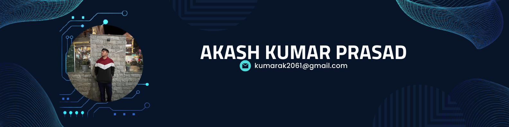
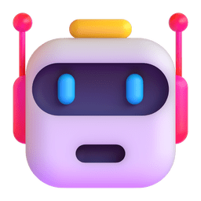
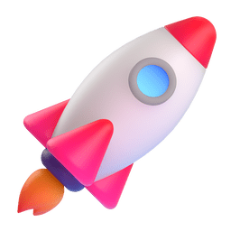
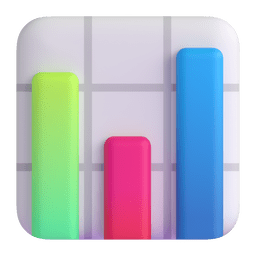

  

<h1 align="center">
  Hi, I'm Akash Kumar Prasad
  
</h1>

  

  
  
  
  
  

##  About me

I build full-stack web apps and the AI behind them: RAG-based support agents, LLM chatbots that stay in character, and computer-vision tools. Most of my projects begin with a real problem. Examples include helping people find the government schemes they qualify for, and turning speech into Indian Sign Language.

- 🎓 Final-year student at **NIT Allahabad**, Prayagraj
- 🔭 **Right now:** LLM agents and evaluation (RAG, LLM-as-a-judge), plus network-security ML and robotics side projects
- 💼 **Open to:** SDE and AI/ML engineering roles and internships
- ⚡ **Fun fact:** I made an AI that lets you argue with Karna about loyalty

 

##  Featured projects

| | |
|:--|:--|
| 🏹 **[MahabharatGPT](https://github.com/Akashkrp/MahabharatGPT)** Chat with 27 Mahabharata characters (Krishna, Karna, Draupadi…), each grounded in curated "memories" so they stay in character.    | 🇮🇳 **[Yojana Saathi](https://github.com/Akashkrp/Yojana-Sathi)** Voice-first, multilingual companion (10+ Indian languages) that matches users to 30+ government welfare schemes. Built for CodeQuest 2026.   |
| 🎧 **[AI Support Agent](https://github.com/Akashkrp/Support-Agent---Hiver)** Autonomous Twitter support agent trained on real @AppleSupport conversations. Includes hybrid RAG, calibrated human escalation, and an LLM-as-a-judge eval harness.    | 🎨 **[ScribZo](https://github.com/Akashkrp/ScribZo)** Multiplayer draw-and-guess game with live camera, five chaotic game modes (Imposter, Gartic Phone, Teams…), and an AI judge.   |
| 📝 **[MeetNoteAI](https://github.com/Akashkrp/MeetNoteAI)** Turns meeting transcripts into editable AI summaries and emails them out.    | 🤟 **[ISL Generator](https://github.com/Akashkrp/Indian-Sign-language-ISL-generatorfrom-audio-visual)** Converts English/Hindi audio-visual content into Indian Sign Language and back.   |

More: <a href="https://nexordata.vercel.app">Nexordata</a> · <a href="https://github.com/Akashkrp/Drowsiness-Detection-System">Drowsiness Detection</a> · <a href="https://github.com/Akashkrp?tab=repositories">all repos →</a>

##  Tech stack

  

##  GitHub stats

  
  

  

  <picture>
    <source media="(prefers-color-scheme: dark)" srcset="https://raw.githubusercontent.com/Akashkrp/AkashKrp/output/github-snake-dark.svg" />
    <source media="(prefers-color-scheme: light)" srcset="https://raw.githubusercontent.com/Akashkrp/AkashKrp/output/github-snake.svg" />
    
  </picture>

